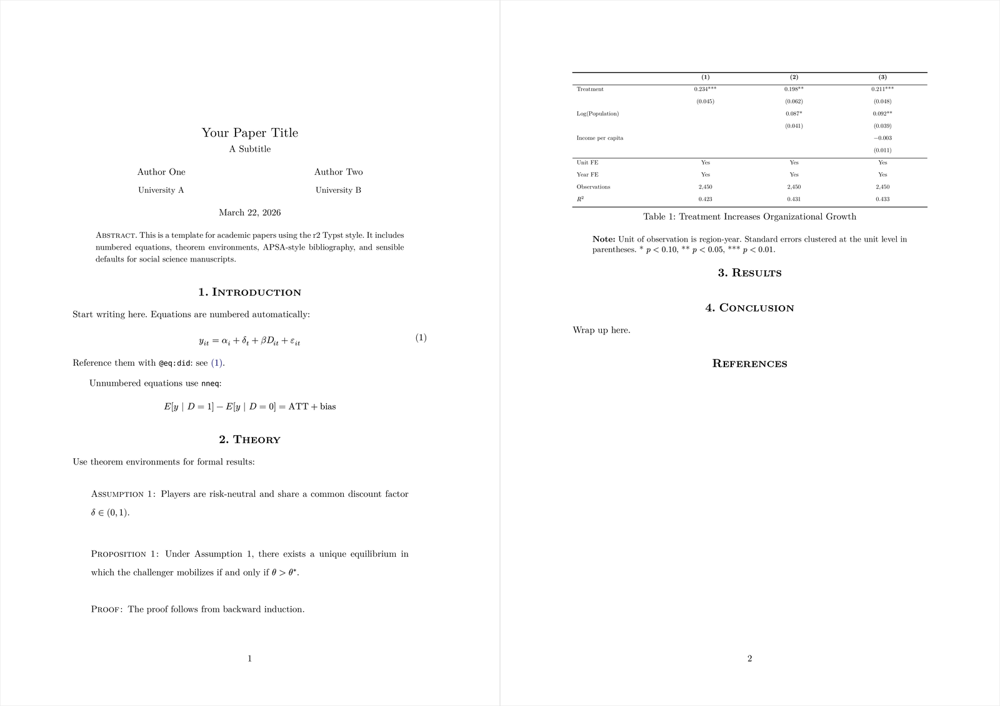
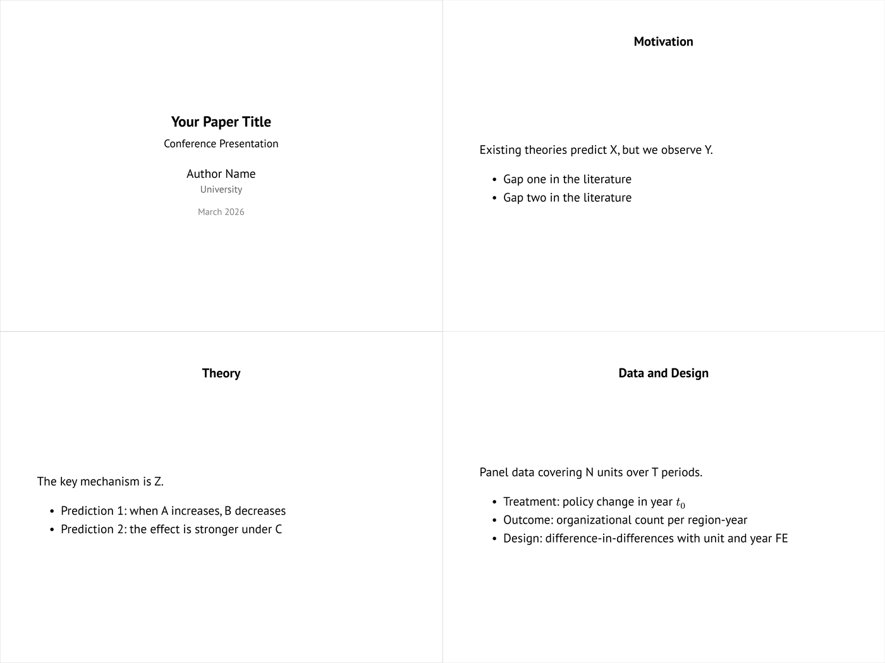

# r2-typst

LaTeX-like minimalist Typst template for academic papers and presentation slides.

One style file powers both your manuscript and your talk — change the design tokens once, and everything updates.

## Preview

**Paper**



**Slides**



## Features

- **Paper layout**: title block, abstract, numbered sections, bibliography
- **Slides layout**: 4:3 Polylux slides with matching title slide
- **Theorem environments**: Proposition, Lemma, Assumption, Theorem, Proof (via ctheorems)
- **Table helpers**: `caption-with-note`, `table-note` for publication-ready tables
- **Design tokens**: one dictionary controls fonts, colors, spacing, and sizes everywhere
- **Equation tools**: `nneq` for unnumbered display equations, auto-numbered by default

## Quick Start

Copy `lib.typ` into your project, then:

**Paper** ([full example](template/paper.typ)):

```typst
#import "./lib.typ": paper, nneq, caption-note, caption-with-note,
  table-note, theorem, proof, prop, lem, asp

#show: doc => paper(
  title: [My Paper],
  authors: ((name: [Author], affiliation: [University]),),
  date: datetime.today().display("[month repr:long] [day], [year]"),
  abstract: [Your abstract here.],
  doc,
)

= Introduction

Start writing.
```

**Slides** ([full example](template/slides.typ)):

```typst
#import "@preview/polylux:0.4.0": *
#import "./lib.typ": slides-style, title-slide

#show: slides-style

#title-slide(
  title: [My Paper],
  author: [Author Name],
  affiliation: [University],
)

#slide[
  = Motivation
  #set align(horizon)
  - Point one
  - Point two
]
```

Compile with:

```bash
typst compile --root . paper.typ
typst compile --root . slides.typ
```

## Customization

Override any design token by passing a `style` dictionary:

```typst
#show: doc => paper(
  title: [My Paper],
  style: (
    body_font: "Libertinus Serif",
    body_size: 12pt,
    accent_main: rgb(0, 80, 0),
    paragraph_indent: 0em,
  ),
  doc,
)
```

### All available tokens

```typst
default-style = (
  // Page
  page_margin: (x: 1.2in, y: 1.2in),
  page_numbering: "1",

  // Typography
  body_font: "New Computer Modern",
  body_size: 11pt,
  body_color: black,
  body_top_edge: 0.7em,
  body_bottom_edge: -0.3em,
  paragraph_leading: 1em,
  paragraph_indent: 1.8em,

  // Headings
  heading_numbering: "1.",
  heading_size: 1em,
  heading_weight: "bold",
  heading_color: black,
  heading_level1_size: 0.9em,

  // Title block
  title_size: 1.4em,
  subtitle_size: 1em,
  title_leading: 0.5em,

  // Abstract
  abstract_size: 0.9em,
  abstract_leading: 0.4em,

  // Tables and figures
  table_text_size: 0.8em,
  table_leading: 0.65em,
  table_top_edge: 0.35em,
  table_bottom_edge: -0.3em,
  block_above: 1.5em,
  block_below: 1.5em,

  // Footnotes
  footnote_numbering: "[1]",

  // Colors
  accent_main: rgb(0, 0, 100),
  accent_link: rgb(0, 0, 100),
  accent_ref: rgb(0, 0, 100),
  accent_cite: rgb(0, 0, 100),
  accent_footnote: rgb(0, 0, 100),
)
```

## Dependencies

- [ctheorems](https://typst.app/universe/package/ctheorems) (theorem environments)
- [polylux](https://typst.app/universe/package/polylux) (slides only)

## License

MIT
